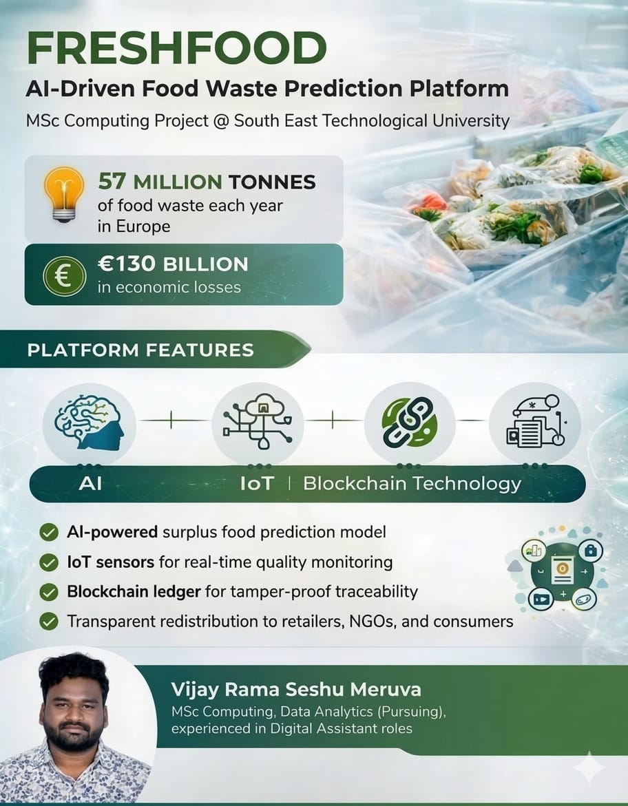
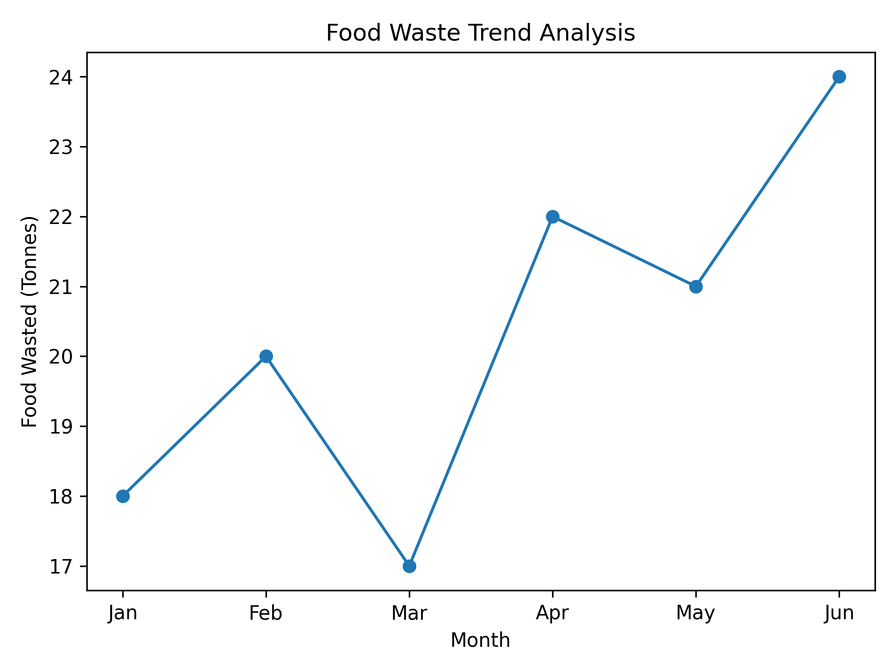

# FRESHFOOD – AI-Driven Food Waste Prediction & Analytics Platform
## Project Poster

AI-driven food waste prediction and traceability platform using analytics, IoT, blockchain, and dashboard-driven decision support.

---

## Project Overview

Food waste is one of the most critical environmental and economic challenges globally.  
In Europe alone, over **57 million tonnes of food waste are generated annually**, leading to **over €130 billion in economic losses**.

The **FRESHFOOD platform** is designed to address this challenge using data-driven technologies. The platform integrates **AI-based predictive analytics, IoT monitoring, and blockchain traceability** to reduce food waste, improve supply chain transparency, and support sustainability initiatives.

---

## Project Objectives

The main objective of this project is to design a smart food waste management platform that:

- Predicts surplus food using AI analytics
- Monitors food quality using IoT sensors
- Ensures transparency using blockchain technology
- Enables data-driven decision making for businesses and NGOs
- Supports sustainability and circular economy initiatives

---

## Platform Architecture

The system follows a data-driven workflow:

Data Sources → Monitoring → Prediction → Blockchain → Interface → Outcomes

1. **Data Sources**
   - Retail inventory data
   - Supply chain logistics data
   - Expiry and shelf-life data
   - Environmental sensor data

2. **Monitoring Layer**
   - IoT sensors track food conditions
   - Temperature and storage monitoring
   - Real-time logistics data collection

3. **Prediction Engine**
   - AI models predict surplus food
   - Demand forecasting
   - Inventory optimization

4. **Blockchain Layer**
   - Secure food traceability
   - Verified redistribution records
   - Transparent donation tracking

5. **User Interface**
   - Web dashboards for retailers and NGOs
   - Monitoring and reporting tools
   - Data visualization for decision-makers

6. **Outcomes**
   - Reduced food waste
   - Better redistribution of surplus food
   - Improved operational efficiency
   - Sustainability impact

---

## Analytics & Data Perspective

From a data analytics perspective, the platform enables:

- Data collection from multiple operational sources
- Data cleaning and transformation
- Predictive analytics for food surplus forecasting
- KPI tracking for sustainability performance
- Dashboard-driven decision support

This aligns closely with **business intelligence and analytics workflows used in modern data-driven organizations.**

---
## Technologies & Tools

- Python
- Pandas
- Scikit-learn
- ## Skills Demonstrated

This project demonstrates the following skills:
- Data Analytics
- Predictive Analytics
- Data Modelling
- Business Intelligence
- KPI Reporting
- Dashboard-Oriented Thinking
- Problem Solving
- Data-Driven Decision Making

---

## Repository Contents

This repository includes:

- Business Proposal
- Project Concept Documentation
- Project Presentation
- Project Poster
- Architecture Overview

---
## Academic Context

This project was inspired by coursework completed during the MSc Computing (Information Systems & Processes) programme at **South East Technological University (SETU), Waterford, Ireland**.

The concept was further expanded and documented by me from a **data analytics and reporting perspective**, focusing on predictive analytics, KPI tracking, and decision-support systems.

## My Contribution

For this repository, I developed and documented the **data analytics and reporting perspective** of the platform, including:

- problem analysis and business use-case framing
- analytics-driven solution design
- KPI definition and reporting framework
- system workflow interpretation
- business intelligence perspective for decision-makers

---

## Future Improvements

Potential future enhancements include:

- Machine learning models for food demand prediction
- Power BI dashboards for food waste monitoring
- SQL-based data warehouse for supply chain data
- Python-based predictive analytics models
- API integration for retail and NGO systems

---

## Why This Project Matters

This project reflects my transition from operational reporting and data analytics into analytics-driven solution design and predictive analytics.
It combines **predictive analytics, monitoring systems, and data transparency** to support sustainability and data-driven decision making.
## Sample Analytics Implementation

This repository also includes a simple Python-based analytics example:

- `food_waste_analysis.py`

The script demonstrates:
- sample food waste data modelling
- KPI calculation
- waste and recovery percentage analysis
- simple trend-based prediction using linear regression

This reflects the analytics perspective of the FreshFood platform and connects the business idea with practical data analysis.
---## Food Waste Trend Analysis

This chart shows a simple trend analysis of monthly food waste used in the sample analytics script.

